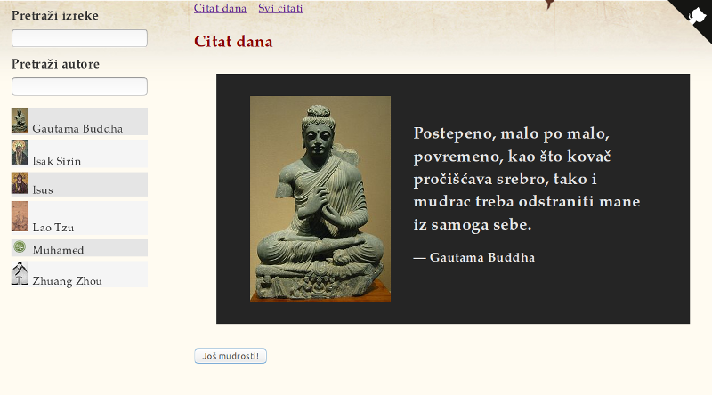

[](https://standardjs.com)
[](https://github.com/skolakoda/programming-quotes/blob/master/LICENSE)
[](https://paypal.me/skolakoda)

[](https://skolakoda.org/programming-quotes/)

# Programming Quotes

**Programming Quotes, open source React app.**

Visit: [skolakoda.org/programming-quotes](https://skolakoda.org/programming-quotes/)

Backend API is [here](https://github.com/skolakoda/baza-podataka).

## Development

Prerequisites: you should have Node.js and git installed.

### Start

Clone repo, then:

```
npm install
npm start

```

### Deploy

```
npm run deploy
```

See CRA deploy on GitHub Pages [docs](https://github.com/facebookincubator/create-react-app/blob/master/packages/react-scripts/template/README.md#github-pages).

## How to contribute

See: [Contributing](CONTRIBUTING.md)

Ako želiš da se uključiš, ali ne znaš kako, pročitaj uputstvo: [Kako doprinositi projektima?](http://skolakoda.org/kako-doprinositi/)

[Ovde](https://trello.com/b/fBcFTxgo/programming-quotes) možeš videti šta je sve potrebno uraditi. Upoznaj se dobro sa projektom i konvencijama pre nego počneš doprinositi. Imamo politiku nulte tolerancije prema tehničkom dugu.

## Style Guide

Kodni standard na projektu je varijacija [*JavaScript Standard Style*](https://standardjs.com/), čije su glavne značaljke:

- bez tački-zareza
- 2 razmaka za poravnanje
- polunavodnici za strune
- `===` umesto `==` za poređenje

Ovde možete preuzeti [ESLint config file](https://github.com/skolakoda/kodni-standard/blob/master/.eslintrc).
